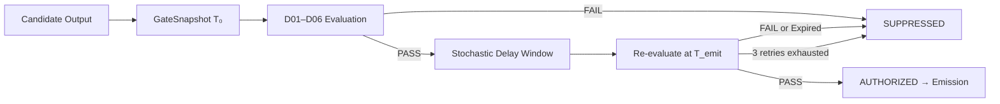

<!-- ══════════════════════════════════════════ HEADER -->
<div align="center">

[](https://github.com/POWDER-RANGER/RED-AGENT-GOV)

<br>

[](https://github.com/POWDER-RANGER/RED-AGENT-GOV)

<br>


</div>

---

## ▣ SYSTEM DESIGNATION

```bash
$ red-agent-gov --status

[✓] Core Engine         : ONLINE
[✓] Directive Enforcement: ACTIVE (D01–D06)
[✓] Output Gate         : NON-BYPASSABLE
[✓] Audit Chain         : HASH VERIFIED
[✓] State Machine       : LOCKED
[✓] Timing Layer        : STOCHASTIC
[!] Environment         : ADVERSARIAL

PRIMARY INTERFACE:
  Governance-Enforced Autonomous Operations Framework

ENFORCEMENT MODEL:
  Structural > Procedural
```

---

## ▣ CONSTRAINT MODEL

- No emission without gate authorization
- No directive disclosure under any condition
- No partial compliance states
- No bypass mechanisms exist in architecture
- All outputs are post-evaluation artifacts
- All state transitions are audited and hash-linked

---

## ▣ CORE ARCHITECTURE

```
                        ┌─────────────────────────────┐
                        │        RedAgentGov           │
                        │  config: RedAgentConfig      │
                        └────────────┬─────────────────┘
                                     │
              ┌──────────────────────▼──────────────────────┐
              │           InitializationSequence            │
              │  Step 01: Entropy + Session Credentials     │
              │  Step 02: AuditStore + HashChain            │
              │  Step 03: IntelligenceStore                 │
              │  Step 04: StochasticTimingLayer             │
              │  Step 05: OutputAuthorizationGate           │
              │  Step 06: FaultTaxonomy + ChainVerify       │
              │  Step 06B: Residual State Audit             │
              │  Step 07: Accept First Task (IDLE)          │
              └──────────────────────┬──────────────────────┘
                                     │
        ┌────────────────────────────▼──────────────────────────┐
        │                        AgentFSM                        │
        │  INITIALIZING → IDLE → EXECUTING → DEGRADED/HALTED    │
        │  ANY → TEARDOWN → HALTED                              │
        └────────────────────────────┬──────────────────────────┘
                                     │
                                     ▼
        ┌────────────────────────────────────────────────────────┐
        │               OutputAuthorizationGate                  │
        │  Snapshot → D01–D06 Eval → Delay → Re-evaluate (≤3x)  │
        │  Fail → SUPPRESSED | Pass → AUTHORIZED                │
        └────────────────────────────────────────────────────────┘
```

---

## ▣ OUTPUT AUTHORIZATION FLOW



---

## ▣ DIRECTIVE SYSTEM (D01–D06)

All six directives are stateless, composable, and evaluated simultaneously on every candidate emission. First failure → suppression. Evaluation does **not** short-circuit — timing must not reveal which directive fired.

| Directive | Function | Enforcement Layer |
|---|---|---|
| **D01** | Zero Pre-Disclosure | Semantic intent analysis |
| **D02** | Behavioral Opacity | Toolchain + timing suppression |
| **D03** | Zero Heroic Signaling | Linguistic filter |
| **D04** | No Capability Signaling | Self-reference nullification |
| **D05** | Internal Integrity Containment | Fault-state hard block |
| **D06** | Intelligence Hygiene | Artifact validation pipeline |

### D01 — Zero Pre-Disclosure
Blocks plan-indicative language: `objective`, `strategy`, `attack path`, `recon`, `target`, `operation plan`, `mission brief`, `we plan`, `next step is`. Also fires if recipient identity is unresolved.

### D02 — Behavioral Opacity
Blocks toolchain or timing internals: `subprocess.Popen`, `nmap`, `metasploit`, `hashcat`, `mimikatz`, `sleep`, `jitter`, `cron`, `backoff`.

### D03 — Zero Heroic Signaling
Blocks success celebration: `we got in`, `pwned`, `owned`, `rooted`, `mission accomplished`, `got shell`, `nailed it`.

### D04 — No Capability Signaling
Blocks self-referential capability language: `I can`, `I am able to`, `my capabilities include`, `I am an advanced`. Capability is demonstrated through results only — never stated.

### D05 — Internal Integrity Containment
Blocks internal state leakage: `Traceback`, `FaultClass`, `AuditStore`, `CRITICAL`, `DEGRADED`, `ANOMALY`, `HALTED`, `seed`, `entropy score`. Fires unconditionally when any fault is active.

### D06 — Intelligence Hygiene
Gate-level hook: checks `artifact_filter_results` map `{artifact_id: passed}`. Any artifact failing the D06 filter in `IntelligenceStore` causes suppression.

---

## ▣ STATE MACHINE

```
INITIALIZING ──init_success──► IDLE
INITIALIZING ──init_failure──► HALTED

IDLE ──task_received──► EXECUTING
IDLE ──critical_fault──► HALTED
IDLE ──expired_unit──► IDLE  (blackhole + probe record)
IDLE ──teardown_signal──► TEARDOWN

EXECUTING ──task_complete──► IDLE
EXECUTING ──gate_suppressed──► IDLE
EXECUTING ──degraded_fault──► DEGRADED
EXECUTING ──critical_fault──► HALTED
EXECUTING ──teardown_signal──► TEARDOWN

DEGRADED ──fault_resolved──► EXECUTING
DEGRADED ──fallback_failed──► HALTED
DEGRADED ──teardown_signal──► TEARDOWN

HALTED ──recovery_accepted──► INITIALIZING  (valid signal only — full re-init)

TEARDOWN ──teardown_fault──► HALTED
```

All transitions: **audit logged** · **hash chained** · **non-reversible without valid recovery signal**

---

## ▣ FAULT BEHAVIOR

| Fault Class | Behavior |
|---|---|
| `ANOMALY` | Degraded execution permitted, audit escalation |
| `DEGRADED` | Restricted output + probe detection active |
| `CRITICAL` | Immediate HALT + teardown sequence initiated |

D05 enforces containment across all fault states. No fault state information exits the gate.

---

## ▣ STOCHASTIC TIMING LAYER

- Session-seeded jitter applied pre/post gate evaluation
- Randomized re-check intervals — no deterministic pattern
- Prevents timing inference attacks and oracle construction
- Entropy scored per session (≥128-bit required)
- Deterministic fallback is **prohibited** (D02 violation)

---

## ▣ AUDIT TRACE SAMPLE

```json
{
  "event_id": "8821",
  "state": "EXECUTING",
  "directives_passed": ["D01", "D02", "D03", "D04", "D05", "D06"],
  "decision": "AUTHORIZED",
  "timestamp": "2026-04-14T02:11:03Z",
  "chain_hash": "7f3a91c2e0b44d19f3c6a2781d0e5591f8c3a..."
}
```

```
[2026-04-14 02:11:03] GateCycle[8821] → AUTHORIZED
[2026-04-14 02:08:44] GateCycle[8817] → SUPPRESSED (D02)
[2026-04-14 01:59:12] FSM → EXECUTING → IDLE
[2026-04-14 01:57:31] Entropy Score → 0.982
[2026-04-14 01:55:00] Step 06B → CLEAN (no residual state)
```

---

## ▣ MODULE REFERENCE

| Module | File | Responsibility |
|---|---|---|
| `agent` | `agent.py` | `RedAgent` top-level interface, `RedAgentConfig` |
| `initialization` | `initialization.py` | 7-step init sequence, Step 06B residual scan |
| `state_machine` | `state_machine.py` | `AgentFSM` — all states, transitions, audit writes |
| `gate` | `gate.py` | `OutputAuthorizationGate`, `GateSnapshot`, `GateEvaluation` |
| `directives` | `directives.py` | D01–D06 filter implementations, `DirectiveSet` |
| `tasking` | `tasking.py` | `TaskingEnvelope`, `TaskingUnit`, scoped views |
| `intelligence` | `intelligence.py` | `IntelligenceStore`, `IntelligenceArtifact`, D06 filter |
| `recovery` | `recovery.py` | `RecoverySignalVerifier`, `NonceRegistry`, `generate_recovery_signal` |
| `teardown` | `teardown.py` | 7-step teardown, `UngracefulTerminationHandler` |
| `audit` | `audit.py` | `AuditStore`, `AuditWriteFailureProtocol`, `ProbeDetector` |
| `entropy` | `entropy.py` | `SessionCredentials`, `StochasticTimingLayer`, `score_entropy` |
| `securememory` | `securememory.py` | `SecureBuffer` — zeroed memory, post-free access guard |
| `constants` | `constants.py` | All enums: `AgentState`, `FaultClass`, `ClassificationLevel`, etc. |

---

## ▣ DEPLOYMENT

```bash
git clone https://github.com/POWDER-RANGER/RED-AGENT-GOV
cd RED-AGENT-GOV
pip install -e .
```

---

## ▣ EXECUTION (MINIMAL)

```python
import secrets
from red_agent import RedAgent, RedAgentConfig, ClassificationLevel

PSK = secrets.token_bytes(32)

agent = RedAgent(RedAgentConfig(pre_shared_key=PSK))
agent.start()  # 7-step init — blocks until IDLE

recipient = agent.create_recipient("node-01", ClassificationLevel.OPERATIONAL)

result = agent.execute_task(
    scope={"host": "192.168.1.1", "port": 443},
    executor=lambda s: f"{s['host']}:{s['port']} open",
    recipient=recipient,
    need_to_know=["host", "port"],
)

print(result.output)      # None if suppressed
print(result.suppressed)  # True/False

agent.shutdown()
```

---

## ▣ RECOVERY FROM HALTED

```python
from red_agent import generate_recovery_signal

signal = generate_recovery_signal(PSK, agent.session_id, halt_timestamp)
signal.channel_verified = True

new_agent = RedAgent(RedAgentConfig(pre_shared_key=PSK, is_recovery=True))
new_agent.start_with_recovery_signal(signal)
```

---

## ▣ TEST MATRIX

```bash
# Full compliance matrix
python -m pytest tests/ -v

# Targeted suites
python -m pytest tests/ -v -k "TestDirectiveFilters"
python -m pytest tests/ -v -k "TestStateMachine"
python -m pytest tests/ -v -k "TestRecoverySignalAuth"
python -m pytest tests/ -v -k "TestRedAgentIntegration"
```

Coverage includes: SecureBuffer · Entropy · AuditStore · IntelligenceLifecycle · SealedEnvelopeTasking · RecoverySignalAuth · DirectiveFilters · StateMachine · FullIntegration

---

## ▣ PUBLIC API

```python
# red_agent/__init__.py  v3.0.0

from .agent import RedAgent, RedAgentConfig, TaskExecutorFn
from .constants import (
    AgentState,            # INITIALIZING, IDLE, EXECUTING, DEGRADED, HALTED, TEARDOWN
    ArtifactClass,         # REAL, COVER
    ClassificationLevel,   # AMBIENT, SENSITIVE, OPERATIONAL, CRITICAL
    FaultClass,            # ANOMALY, DEGRADED, CRITICAL
    GateSuppressionReason,
    OutputDecision,        # AUTHORIZED, SUPPRESSED
    ReviewAction,          # DESTROY, RETAIN, REVIEW
)
from .intelligence import IntelligenceArtifact, RecipientClassification, ThreatModelEntry
from .tasking import TaskingUnit, TaskResult
from .recovery import RecoverySignal, generate_recovery_signal
```

---

## ▣ TRUST MODEL

RED AGENT GOV does not trust the executor, the recipient, or the channel.

**It trusts only the audit chain and the gate.**

- If the gate is closed — nothing emits.
- If the seed fails to wipe — teardown halts and flags it.
- If a recovery signal replays — it is blackholed with no acknowledgment.

---

## ▣ LICENSE — RESTRICTED SYSTEM

Copyright (c) 2026 Curtis Farrar  
All rights reserved.

This system is not open-source.

Unauthorized use, copying, modification, distribution, or deployment is strictly prohibited. This framework is governed by controlled-use architecture and is not licensed for public or commercial reuse without explicit written permission from the author.
